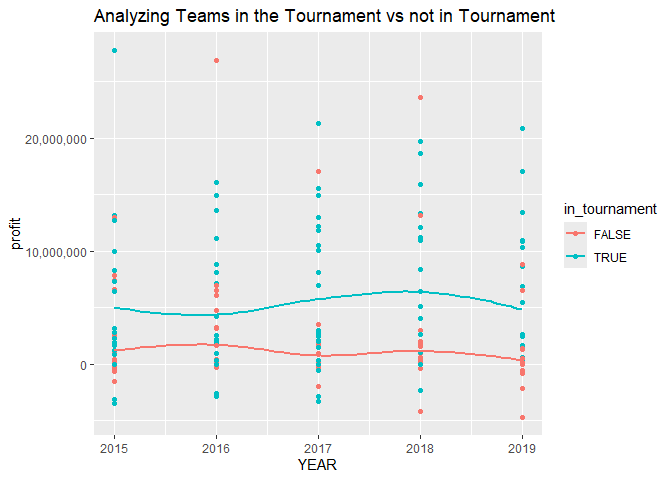
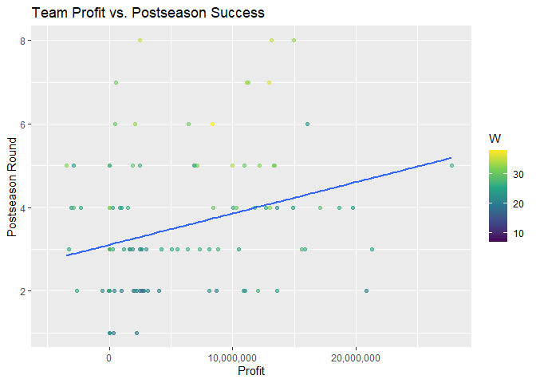

# README

## College Basketball Spending

    Attaching package: 'dplyr'

    The following objects are masked from 'package:stats':

        filter, lag

    The following objects are masked from 'package:base':

        intersect, setdiff, setequal, union

    Warning: package 'ggplot2' was built under R version 4.4.3

    ── Attaching core tidyverse packages ──────────────────────── tidyverse 2.0.0 ──
    ✔ forcats   1.0.0     ✔ readr     2.1.5
    ✔ ggplot2   4.0.2     ✔ stringr   1.5.1
    ✔ lubridate 1.9.4     ✔ tibble    3.2.1
    ✔ purrr     1.0.2     ✔ tidyr     1.3.1

    ── Conflicts ────────────────────────────────────────── tidyverse_conflicts() ──
    ✖ dplyr::filter() masks stats::filter()
    ✖ dplyr::lag()    masks stats::lag()
    ℹ Use the conflicted package (<http://conflicted.r-lib.org/>) to force all conflicts to become errors

    Warning: package 'fuzzyjoin' was built under R version 4.4.3

    Warning: package 'plotly' was built under R version 4.4.3

    Attaching package: 'plotly'

    The following object is masked from 'package:ggplot2':

        last_plot

    The following object is masked from 'package:stats':

        filter

    The following object is masked from 'package:graphics':

        layout

    Warning: package 'shiny' was built under R version 4.4.3

    Rows: 132327 Columns: 28
    ── Column specification ────────────────────────────────────────────────────────
    Delimiter: ","
    chr  (8): institution_name, city_txt, state_cd, zip_text, classification_nam...
    dbl (20): year, unitid, classification_code, ef_male_count, ef_female_count,...

    ℹ Use `spec()` to retrieve the full column specification for this data.
    ℹ Specify the column types or set `show_col_types = FALSE` to quiet this message.
    Rows: 353 Columns: 23
    ── Column specification ────────────────────────────────────────────────────────
    Delimiter: ","
    chr  (3): TEAM, CONF, POSTSEASON
    dbl (20): G, W, ADJOE, ADJDE, BARTHAG, EFG_O, EFG_D, TOR, TORD, ORB, DRB, FT...

    ℹ Use `spec()` to retrieve the full column specification for this data.
    ℹ Specify the column types or set `show_col_types = FALSE` to quiet this message.
    Rows: 2102 Columns: 24
    ── Column specification ────────────────────────────────────────────────────────
    Delimiter: ","
    chr  (3): TEAM, CONF, POSTSEASON
    dbl (21): G, W, ADJOE, ADJDE, BARTHAG, EFG_O, EFG_D, TOR, TORD, ORB, DRB, FT...

    ℹ Use `spec()` to retrieve the full column specification for this data.
    ℹ Specify the column types or set `show_col_types = FALSE` to quiet this message.

    # A tibble: 1,757 × 7
       TEAM           CONF      G     W POSTSEASON  SEED  YEAR
       <chr>          <chr> <dbl> <dbl> <chr>      <dbl> <dbl>
     1 north carolina ACC      40    33 2ND            1  2016
     2 wisconsin      B10      40    36 2ND            1  2015
     3 michigan       B10      40    33 2ND            3  2018
     4 gonzaga        WCC      39    37 2ND            1  2017
     5 duke           ACC      39    35 Champions      1  2015
     6 north carolina ACC      39    33 Champions      1  2017
     7 villanova      BE       40    35 Champions      2  2016
     8 villanova      BE       40    36 Champions      1  2018
     9 louisville     ACC      36    27 E8             4  2015
    10 notre dame     ACC      38    32 E8             3  2015
    # ℹ 1,747 more rows

During my Data Visualization class, my final project focuses on college
basketball spending from 2015 through 2019. The goal of my data is to
determine if a team who makes more profit from their basketball teams
ultimately leads to more wins. Throughout the project, I made a
multitude of visuals to display this along with a shiny application.
There is a slight trend that shows more profitable basketball teams
correlates with more wins and a better finish in March Madness. With
this being prior to NIL, the world of basketball has changed and the
spending on college basketball teams has not only changed, but ballooned
in size.

    `geom_smooth()` using method = 'loess' and formula = 'y ~ x'

    Warning: The following aesthetics were dropped during statistical transformation: label.
    ℹ This can happen when ggplot fails to infer the correct grouping structure in
      the data.
    ℹ Did you forget to specify a `group` aesthetic or to convert a numerical
      variable into a factor?

The visual above depicts teams who made the NCAA March Madness
tournament from 2015 to 2019 with profit of each team during each year.
Based on the visual, there is clear correlation between teams who made
the tournament versus those who did not. Teams who made the tournament
were in the range of 5 million dollars profit each year. While teams who
did not make the tournament were in the realm of 500,000 dollars to
maybe \$1.5 million.

Profits versus Postseason success

    `geom_smooth()` using formula = 'y ~ x'

    Warning: Removed 192 rows containing non-finite outside the scale range
    (`stat_smooth()`).

    Warning: The following aesthetics were dropped during statistical transformation: colour
    and label.
    ℹ This can happen when ggplot fails to infer the correct grouping structure in
      the data.
    ℹ Did you forget to specify a `group` aesthetic or to convert a numerical
      variable into a factor?

    Warning: Removed 192 rows containing missing values or values outside the scale range
    (`geom_point()`).

This visual does a good job showing a different view from just direct
profit versus postseason success. Although there is definitely evidence
of this. Regular season wins have a huge effect as well. There have been
only 5 teams in the 21st century to win the tournament as 3 seed or
lower. Three of those being three seeds, one four seed, and one seven
seed. To win March Madness, the overwhelming majority says that you must
be high seed to achieve great success in the tournament.
